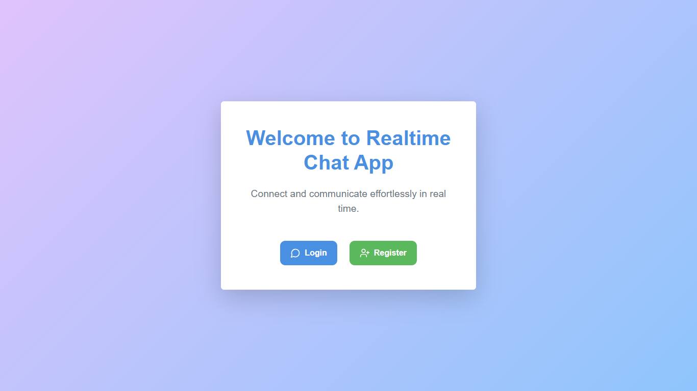
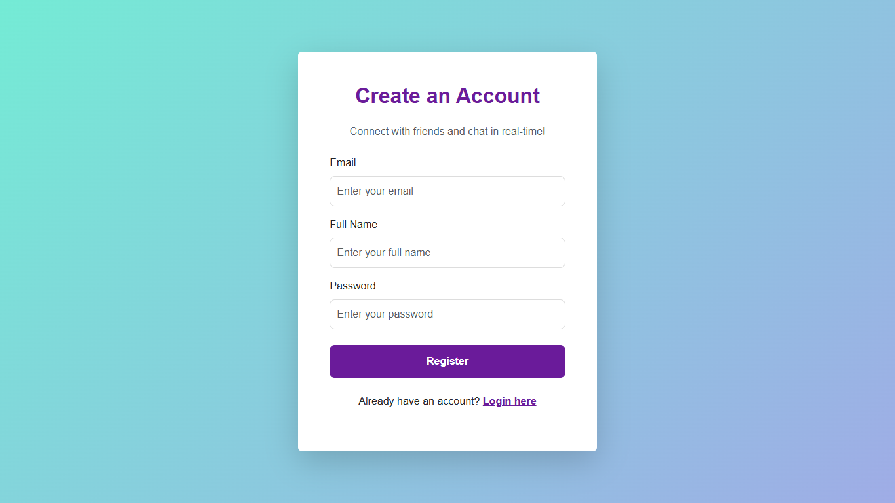
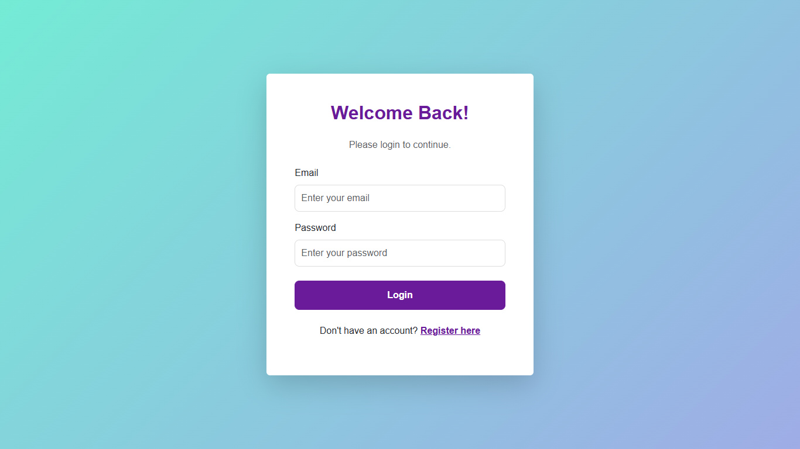
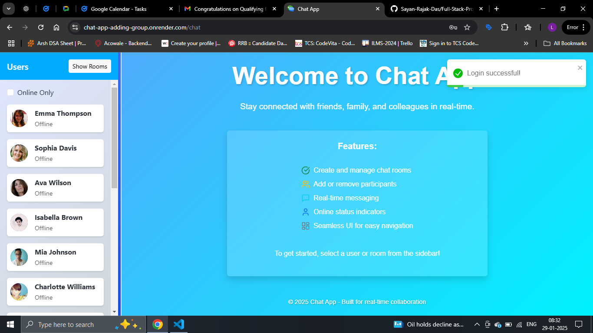
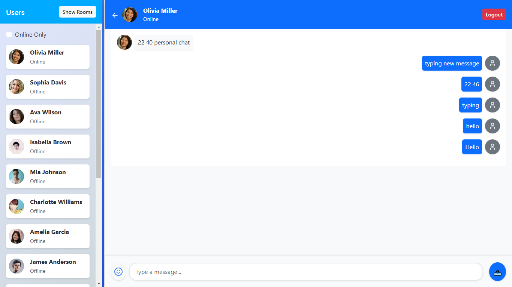
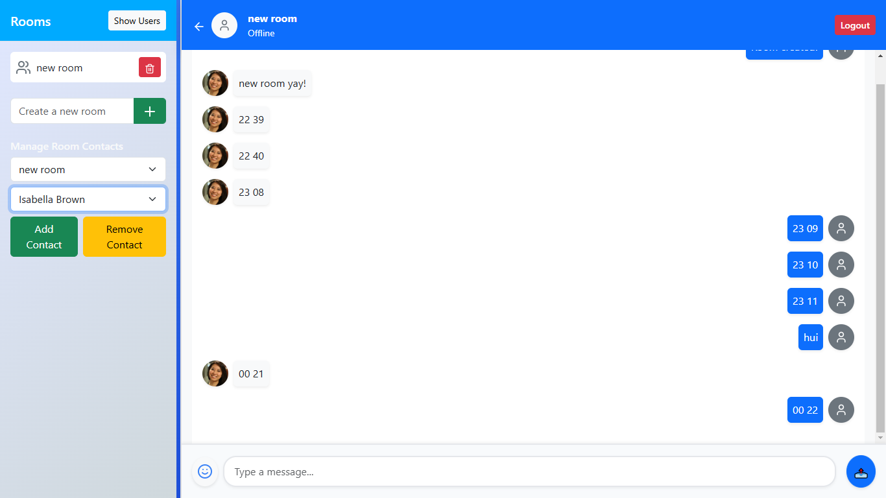

Here’s an updated version of the **README.md** file with the requested changes:

---

# Chat App



This is a simple chat application where users can log in, register, and chat in real-time. Users can also join rooms and chat with others.

---

## Project Screenshots

- **Register**

  

- **Login**

  

- **Home Page**

  

- **Personal Message**

  

- **Group Chat**

  

---

## Live Demo  

You can try out the app live on the following link:  
🔗 [Chat App - Live Demo](https://chat-app-adding-group.onrender.com/)

---

## How to Run the Project in Development Mode  

Follow these steps to run the project locally:

### 1️⃣ Clone the Repository  

```bash
git clone https://github.com/Sayan-Rajak-Das/Chat-App-adding-Group
```

### 2️⃣ Create a `.env` File  

Inside the **backend** directory, create a `.env` file with the following fields:  

```env
MONGODB_URI=
PORT=5001
JWT_SECRET=mysecretkey
CLOUDINARY_CLOUD_NAME=
CLOUDINARY_API_KEY=
CLOUDINARY_SECRET_KEY=
NODE_ENV=development
```

### 3️⃣ Install Dependencies  

In the **root directory**, install the dependencies for both the backend and frontend:

```bash
npm run build
```

> **Note**: If there are any vulnerabilities, navigate to the specific folder (`backend` or `frontend`) and resolve them.

### 4️⃣ Start the Backend  

Ensure you are in the **root directory** and run:  

```bash
npm start
```

### 5️⃣ Start the Frontend  

Navigate to the **frontend** directory and run:  

```bash
cd frontend
npm run dev
```

### 6️⃣ Open in Browser  

Open your browser and go to:  
🔗 `http://localhost:5173`

---

## How to Use  

- **Log in** or **Register** using your credentials.
- Once logged in, you can:  
  - Chat one-on-one with other users.  
  - Join or create chat rooms to participate in group conversations.

---

## Features  

✅ **Real-time messaging** powered by **Socket.IO**  
✅ **Responsive Design** for desktop and mobile views  
✅ **Group Chat Support** (Rooms for discussions)    

---

## Project Notes  

- When switching between **desktop** and **mobile views** (or vice versa), a **page refresh is required** to ensure the correct UI is displayed for the respective mode. *(I am aware of this issue and will address it in future updates.)*  
- Run the backend server from the **root directory** using `npm start`.  
- Run the frontend server from the **frontend folder** using `npm run dev`.
